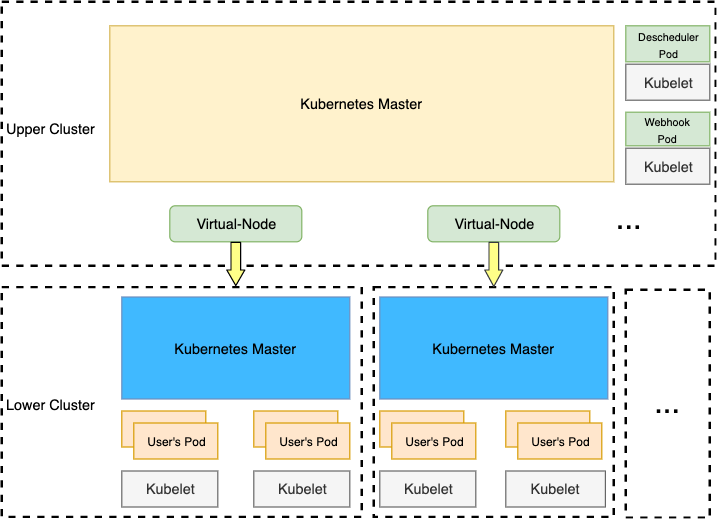
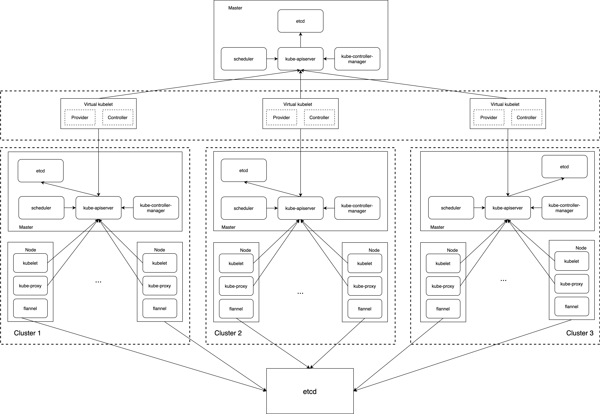

# tensile-kube

## Overview

`tensile-kube` enables kubernetes clusters work together. Based on [virtual-kubelet](https://github.com/virtual-kubelet/virtual-kubelet), `tensile-kube`
provides the following abilities:

- Cluster resource automatically discovery
- Notify pods modification async, decrease the cost of frequently list
- Support all actions of `kubectl logs` and `kubectl exec`
- Globally schedule pods to avoid unschedulable pod due to resource fragmentation when using multi-scheduler
- Re-schedule pods if pod can not be scheduled in lower clusters by using descheduler
- PV/PVC
- Service

## Components

### Arch



- virtual-node

This is a kubernetes provider implemented based on virtual-kubelet. Pods created in the upper cluster
will be synced to the lower cluster. If pods are depend on configmaps or secrets, dependencies would 
also be created in the cluster. 

- multi-cluster scheduler

The scheduler is implemented based on [K8s scheduling framework](https://kubernetes.io/docs/concepts/scheduling-eviction/scheduling-framework/). It would watch all of the lower 
clusters's capacity and call `filter` while scheduling pods. If the number of available nodes is greater 
than or equal to 1, the pods can be scheduler. As you see, this may cost more resources, so we add another 
implementation(descheduler).

The multi-cluster scheduler repo has been removed to [super-scheduling](https://github.com/cwdsuzhou/super-scheduling)

- descheduler

descheduler is inspired by [K8s descheduler](https://github.com/kubernetes-sigs/descheduler), but it cannot 
satisfy all our requirements, so we change some logic. Some unschedulable pods would be re-created by it with some 
nodeAffinity injected.

We can choose one of the multi-scheduler and descheduler in the upper cluster or both.

 > - Large cluster is not recommended to use multi-scheduler, e.g. sum of nodes in sub cluster is more than
 10000, descheduler would cost less.
> - Multi-scheduler would be better when there are fewer nodes in a cluster, e.g. we have 10 clusters but each cluster
 only has 100 nodes.

- webhook

Webhook are designed based on K8s mutation webhook. It helps convert some fields that can affect scheduling pods(not in kube-system) in the upper cluster, e.g. `nodeSelector`, `nodeAffinity` and `tolerations`. But only the pods have a label `virtual-pod:true` would be converted. These fields would be converted into the annotation as follows:
 
```text
    clusterSelector: '{"tolerations":[{"key":"node.kubernetes.io/not-ready","operator":"Exists","effect":"NoExecute"},{"key":"node.kubernetes.io/unreachable","operator":"Exists","effect":"NoExecute"},{"key":"test","operator":"Exists","effect":"NoExecute"},{"key":"test1","operator":"Exists","effect":"NoExecute"},{"key":"test2","operator":"Exists","effect":"NoExecute"},{"key":"test3","operator":"Exists","effect":"NoExecute"}]}'
``` 

This fields we would be added back when the pods created in the lower cluster.

Pods are strongly recommended to run in the lower clusters and add a label `virtual-pod:true`, except for those pods must be deployed in `kube-system` in the upper cluster.
 
> - For K8s< 1.16, pods without the label would not be converted. But queries would still send to the webhook.
> - For K8s>=1.16, we can use label selector to enable the webhook for some specified pods. 
> - Overall, the initial idea is that we only run pods in lower clusters.**

## Restrictions

- If you want to use service, must keep inter-pods communication normal. Pod A in cluster A can be accessed by pod B in cluster B through ip. The service `kubernetes` 
in `default` namespaces and other services in `kube-system` would be synced to lower clusters.

- multi-scheduler developed in the repo may cost more resource because it would sync all objects that a scheduler
 need from all of lower clusters.

- descheduler cannot absolutely avoid resource fragmentation.

- PV/PVC only support `WaitForFirstConsumer`for local PV, the scheduler in the upper cluster should ignore
 `VolumeBindCheck`

## Use Case



In [Tencent Games](https://game.qq.com/), they build the kubernetes cluster based on the [flannel](https://github.com/coreos/flannel) and all node CIDR allocation
 is based on the same etcd. So the pods actually can access each other directly by IP.

## Build

```build
git clone https://github.com/virtual-kubelet/tensile-kube.git && make
```
### virtual node parameters

```build
      --client-burst int            qpi burst for client cluster. (default 1000)
      --client-kubeconfig string    kube config for client cluster.
      --client-qps int              qpi qps for client cluster. (default 500)
      --enable-controllers string   support PVControllers,ServiceControllers, default, all of these (default "PVControllers,ServiceControllers")
      --enable-serviceaccount       enable service account for pods, like spark driver, mpi launcher (default true)
      --ignore-labels string        ignore-labels are the labels we would like to ignore when build pod for client clusters, usually these labels will infulence schedule, default group.batch.scheduler.tencent.com, multi labels should be seperated by comma(,) (default "group.batch.scheduler.tencent.com")
      --log-level string            set the log level, e.g. "debug", "info", "warn", "error" (default "info")
      ...
```

### deploy the virtual node

```build
export KUBELET_PORT=10350
export APISERVER_CERT_LOCATION=/etc/k8s.cer
export APISERVER_KEY_LOCATION=/etc/k8s.key

nohup ./virtual-node --nodename $IP --provider k8s --kube-api-qps 500 --kube-api-burst 1000 --client-qps 500 --client
-burst 1000 --kubeconfig /root/server-kube.config --client-kubeconfig /client-kube.config --klog.v 4 --log-level
 debug 2>&1 > node.log &
```
or deploy in K8s

```shell
# change the config in secret `virtual-kubelet` in `manifeasts/virtual-node.yaml` first,
# change the image
# then deploy it
kubectl apply -f manifeasts/virtual-node.yaml
```

### deploy the webhook

it is recommended to be deployed in K8s cluster

1. replace the ${caBoudle}, ${cert}, ${key} with yours
2. replace the image of webhook
3. deploy it in K8s cluster

```shell
kubectl apply -f manifeasts/webhook.yaml
```

### deploy the descheduler

1. replace the image with yours
2. deploy it in K8s cluster

```shell
kubectl apply -f manifeasts/descheduler.yaml
```

## Main Contributors

- [Weidong Cai](https://github.com/cwdsuzhou) from Tencent
- [Ye Yin](https://github.com/hustcat) from Tencent

## Other Contributors
- [Runzhong Liu](https://github.com/runzhliu)
- [LeoLiuYan](https://github.com/LeoLiuYan)
- [Thomas](https://github.com/tghartland)
